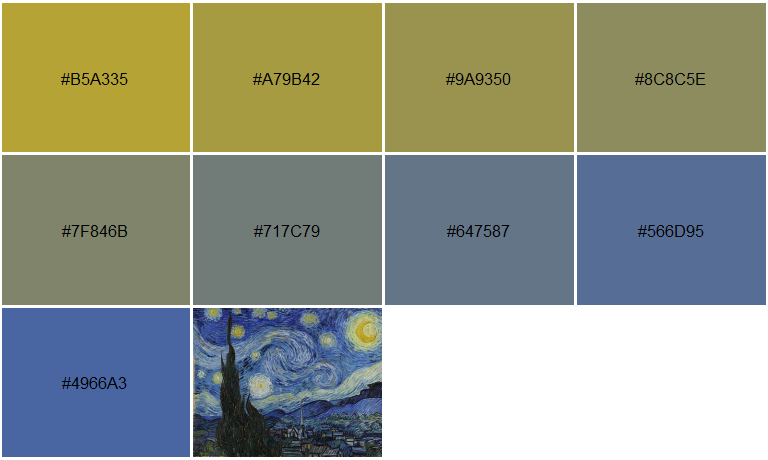
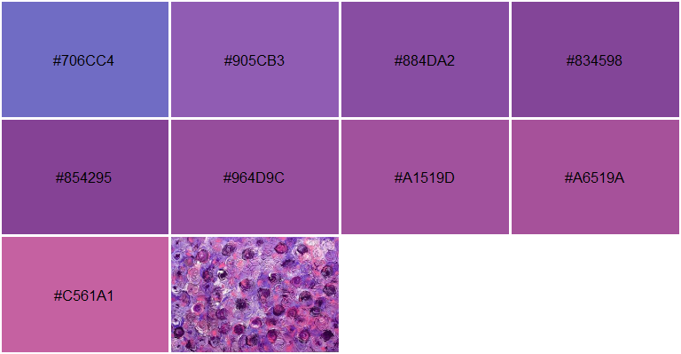
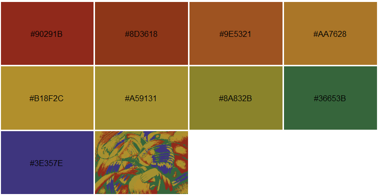
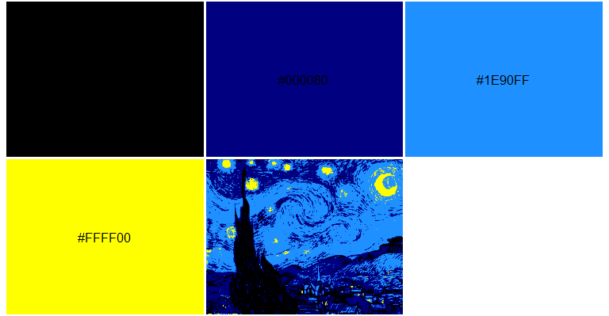

<!-- README.md is generated from README.Rmd. Please edit that file -->

# imgpalr 

**Author:** [Matthew Leonawicz](https://github.com/leonawicz)
<a href="https://orcid.org/0000-0001-9452-2771" target="orcid.widget">
</a>
<br/> **License:** [MIT](https://opensource.org/licenses/MIT)<br/>

[](https://www.repostatus.org/)
[](https://travis-ci.org/leonawicz/imgpalr)
[](https://ci.appveyor.com/project/leonawicz/imgpalr)
[](https://codecov.io/gh/leonawicz/imgpalr?branch=master)

[](https://cran.r-project.org/package=imgpalr)
[](https://cran.r-project.org/package=imgpalr)
[](https://github.com/leonawicz/imgpalr)

[](https://ko-fi.com/leonawicz)

The `imgpalr` package makes it easy to create color palettes from image
files.

  - Choose the type of color palette to derive from an image:
    qualitative, sequential or divergent.
  - Quantiles of an image color distribution can be trimmed.
  - Near-black or near-white colors can be trimmed in RGB space
    independent of trimming brightness or saturation distributions in
    HSV space.
  - Creating sequential palettes also offers control over the order of
    HSV color dimensions to sort by.

## Installation

Install the CRAN release of `imgpalr` with

``` r
install.packages("imgpalr")
```

Install the development version from GitHub with

``` r
# install.packages("remotes")
remotes::install_github("leonawicz/imgpalr")
```

## Examples

The main function is `image_pal`. It accepts PNG, JPG, BMP or GIF (first
frame) images either from disk or URL. It returns a vector of colors
defining a palette based on the image and your other function arguments.
You can also set `plot = TRUE` to plot a preview of the palette, which
includes the source image thumbnail for visual reference.

The examples below offer some typical considerations to make when
deriving a color palette from an arbitrary image.

### Three palette types

In this first set of examples, divergent, qualitative and sequential
palettes are generated from the same image and while varying some
additional settings.

``` r
library(imgpalr)

set.seed(1)
x <- paste0(system.file(package = "imgpalr"), "/",
  c("blue-yellow", "purples", "colors"), ".jpg")

# Three palette types, one image
# A divergent palette
image_pal(x[1], type = "div",
  saturation = c(0.75, 1), brightness = c(0.75, 1), plot = TRUE)
```


``` r

# A qualitative palette
image_pal(x[1], type = "qual", bw = c(0.25, 0.9), plot = TRUE)
```


``` r

 # A sequential palette
image_pal(x[1], type = "seq", k = 2, saturation = c(0.75, 1),
  brightness = c(0.75, 1), seq_by = "hsv", plot = TRUE)
```



### A dominant hue

In this test image, hue varies over a narrow range. A sequential palette
is sensible here, but not necessarily best sorted by hue. Doing so does
still show a perceivable order to the colors, but it is much more
difficult to discern. Sorting the palette first by saturation or
brightness makes a much better sequential palette in this case.

``` r
image_pal(x[2], type = "seq", seq_by = "hsv", plot = TRUE)
```



``` r
image_pal(x[2], type = "seq", seq_by = "svh", plot = TRUE)
```


``` r
image_pal(x[2], type = "seq", seq_by = "vsh", plot = TRUE)
```


### Several hues

Using an image with several prominent hues, a divergent palette is not
sensible here. A sequential is likely best sorted by hue.

Note in the second image below, you can also set `quantize = TRUE` to
show a color-quantized reference thumbnail image based on the derived
palette. This makes use of the `image_quantmap` function. Rather than
only quantizing the image, it does so while also mapping the colors of
any image to an arbitrary color palette based on nearest distances in
RGB space.

``` r
image_pal(x[3], type = "qual", brightness = c(0.4, 1), plot = TRUE)
```


``` r
image_pal(x[3], type = "seq", bw = c(0.2, 1), saturation = c(0.2, 1), 
          plot = TRUE, quantize = TRUE)
```



Palette generation uses k-means clustering; results are different each
time you call `image_pal`. If the palette you obtain does not feel
right, even with fixed arguments you can run it again to obtain a
different palette. Depending on the settings and the nature of the
source image, it may change quite a bit. If you need a reproducible
palette, set the `seed` argument. In the example above, the seed was set
globally to avoid having to set it in each call to `image_pal`.

### Quantize and remap image colors

You can quantize the colors in an image using `image_quantmap` directly.
Choose any vector of colors. Each pixel has its color mapped to
whichever of these colors it is closest to in RGB space. The RGB array
is returned. You can plot the image with the palette.

``` r
x <- system.file("blue-yellow.jpg", package = "imgpalr")
pal <- c("black", "navyblue", "dodgerblue", "yellow")
a <- image_quantmap(x, pal, k = 7, plot = TRUE)
```



``` r
str(a)
#>  num [1:317, 1:400, 1:3] 0 0 0 0 0 0 0 0 0 0 ...
```

This works well if you want to quantize the colors to colors a short
distance away in RGB space, but if you want to also swap them out for
very different colors, this should be a two step process. If you provide
an equal-length vector of colors to the `pal2` argument, these colors
will replace those in `pal` after the initial quantization.

``` r
pal2 <- c("darkred", "darkgreen", "tomato", "orange")
a <- image_quantmap(x, pal, pal2, k = 7, plot = TRUE, show_pal = FALSE)
```


Note: This function can be very slow for large `k` and/or larger images.

## Related resources

There is also the
[RImagePalette](https://CRAN.R-project.org/package=RImagePalette)
package on CRAN, which uses the median cut algorithm for finding they
dominant colors in an image.

`imgpalr` was originally inspired by the
[paletter](https://github.com/AndreaCirilloAC/paletter) package on
GitHub. Both packages use k-means clustering to find key image colors,
but take some different approaches in methods for assembling color
palettes.

The palette preview (without the thumbnail addition) is based off of
`scales::show_col`, which is a convenient function for plotting
palettes. You can also use `pals::pal.bands` to do the same using a
different visual layout.

If you want to directly manipulate the color properties of an image for
its own sake rather than derive color palettes for other purposes, you
can do so using the [magick](https://CRAN.R-project.org/package=magick)
package, which provides bindings to the ImageMagick library.

-----

Please note that the `imgpalr` project is released with a [Contributor
Code of
Conduct](https://github.com/leonawicz/imgpalr/blob/master/CODE_OF_CONDUCT.md).
By contributing to this project, you agree to abide by its terms.
