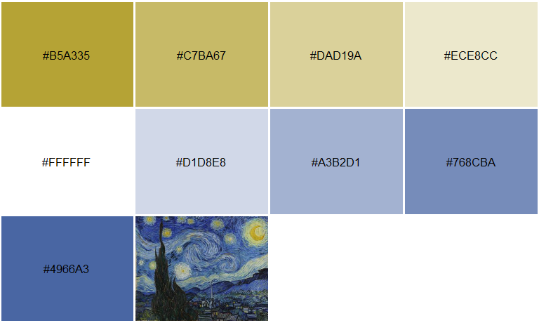
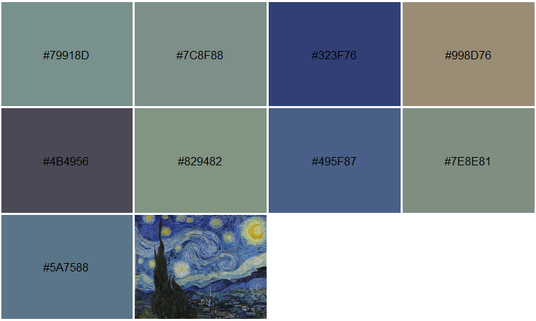

<!-- README.md is generated from README.Rmd. Please edit that file -->
imgpalr 
==============================================================================================================

**Author:** [Matthew Leonawicz](https://leonawicz.github.io/blog/) <a href="https://orcid.org/0000-0001-9452-2771" target="orcid.widget"> <image class="orcid" src="https://members.orcid.org/sites/default/files/vector_iD_icon.svg" height="16"></a> <br/> **License:** [MIT](https://opensource.org/licenses/MIT)<br/>

[](https://cran.r-project.org/package=imgpalr) [](https://cran.r-project.org/package=imgpalr) [](http://www.rdocumentation.org/packages/imgpalr) [](https://travis-ci.org/leonawicz/imgpalr) [](https://ci.appveyor.com/project/leonawicz/imgpalr) [](https://codecov.io/gh/leonawicz/imgpalr?branch=master)

The `imgpalr` package makes it easy to create color palettes from image files.

-   Choose the type of color palette to derive from an image: qualitative, sequential or divergent.
-   Quantiles of an image color distribution can be trimmed.
-   Near-black or near-white colors can be trimmed in RGB space independent of trimming brightness or saturation distributions in HSV space.
-   Creating sequential palettes also offers control over the order of HSV color dimensions to sort by.

Installation
------------

You can install the development version of `imgpalr` from GitHub with:

``` r
# install.packages("remotes")
remotes::install_github("leonawicz/imgpalr")
```

Examples
--------

The main function is `image_pal`. It accepts PNG, JPG, BMP or GIF (first frame) images either from disk or URL. It returns a vector of colors defining a palette based on the image and your other function arguments. You can also set `plot = TRUE` to plot a preview of the palette, which includes the source image thumbnail for visual reference.

The examples below offer some typical considerations to make when deriving a color palette from an arbitrary image.

``` r
library(imgpalr)

set.seed(1)
x <- paste0(system.file(package = "imgpalr"), "/",
  c("blue-yellow", "purples", "colors"), ".jpg")

# Three palette types, one image
# Focus on bright, saturated colors for divergent palette:
image_pal(x[1], type = "div",
  saturation = c(0.75, 1), brightness = c(0.75, 1), plot = TRUE)
```



``` r

# Remove colors too close to black and white for qualitative palette:
image_pal(x[1], type = "qual", bw = c(0.25, 0.9), plot = TRUE)
```



``` r

 # A challenging sequential mapping
image_pal(x[1], type = "seq", saturation = c(0.2, 1),
  brightness = c(0.5, 1), seq_by = "hsv", plot = TRUE)
```


``` r
# An image with one main hue;
# sequential is most sensible, but not necessarily best sorted by hue
image_pal(x[2], type = "seq", seq_by = "hsv", plot = TRUE)
```


``` r
image_pal(x[2], type = "seq", seq_by = "svh", plot = TRUE)
```


``` r
image_pal(x[2], type = "seq", seq_by = "vsh", plot = TRUE)
```


``` r

# An image with one several hues;
# divergent is not sensible here, sequential should be by hue
image_pal(x[3], type = "qual", brightness = c(0.4, 1), plot = TRUE)
```


``` r
image_pal(x[3], type = "seq", bw = c(0.2, 1), saturation = c(0.2, 1), plot = TRUE)
```


Palette generation uses k-means clustering; results are different each time you call `image_pal`. If the palette you obtain does not feel right, even with fixed arguments you can run it again to obtain a different palette. Depending on the settings and the nature of the source image, it may change quite a bit. If you need a reproducible palette, set the `seed` argument. In the example above, the seed was set globally to avoid having to set it in each call to `image_pal`.
